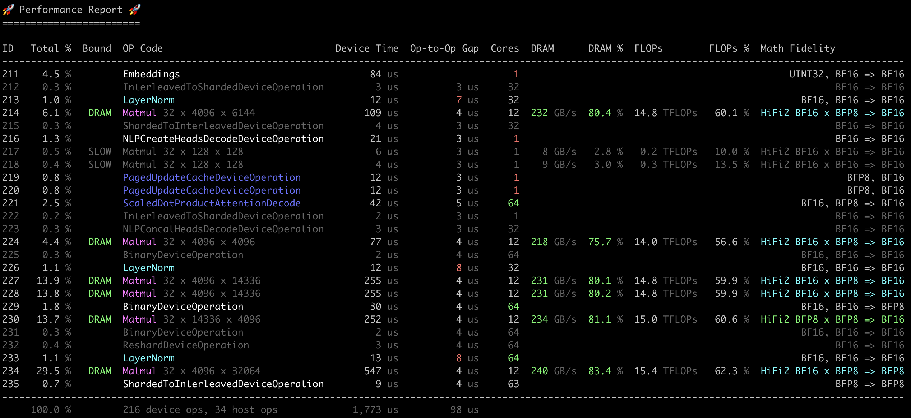

# Performance Report Analysis Tool



This tool analyzes performance traces from Metal operations, providing insights into throughput, bottlenecks, and optimization opportunities.

## Generating Performance Traces

1. Build Metal with performance tracing enabled:
```bash
./build_metal -p
```

2. Run your test with the tracy module to capture traces:
```bash
python -m tracy -r -p -v -m pytest path/to/test.py
```
This generates a CSV file containing operation timing data.

## Using Tracy Signposts

Tracy signposts mark specific sections of code for analysis. Add signposts to your Python code:

```python
import tracy

# Mark different sections of your code
tracy.signpost("Compilation pass")
model(input_data)

tracy.signpost("Performance pass")
for _ in range(10):
    model(input_data)
```

The tool uses the last signpost by default, which is typically the most relevant section for a performance test(e.g., the final iteration after compilation / warmup).

Common signpost usage:
- `--signpost name`: Analyze ops after the specified signpost
- `--ignore-signposts`: Analyze the entire trace

## Filtering Operations

The output of the performance report is a table of operations. Each operation is assigned a unique ID starting from 1. You can re-run the tool with different IDs to focus on specific sections of the trace.

Use `--id-range` to analyze specific sections:
```bash
# Analyze ops 5 through 10
python perf_report.py trace.csv --id-range 5-10

# Analyze from op 31 onwards
python perf_report.py trace.csv --id-range 31-

# Analyze up to op 12
python perf_report.py trace.csv --id-range -12
```

This is particularly useful for:
- Isolating decode pass in prefill+decode LLM inference
- Analyzing single transformer layers without embeddings/projections
- Focusing on specific model components

## Output Options

- `--min-percentage value`: Hide ops below specified % of total time (default: 0.5)
- `--color/--no-color`: Force colored/plain output
- `--csv FILENAME`: Output the table to CSV format for further analysis or inclusion into automated reporting pipelines
- `--no-advice`: Show only performance table, skip optimization advice

## Understanding the Performance Report

The performance report provides several key metrics for analyzing operation performance:

### Core Metrics

- **Device Time**: Time spent executing the operation on device (in microseconds)
- **Op-to-op Gap**: Time between operations, including host overhead and kernel dispatch (in microseconds)
- **Total %**: Percentage of total execution time spent on this operation
- **Cores**: Number of cores used by the operation (max 64 on Wormhole)

### Performance Metrics

- **DRAM**: Memory bandwidth achieved (in GB/s)
- **DRAM %**: Percentage of theoretical peak DRAM bandwidth (288 GB/s on Wormhole)
- **FLOPs**: Compute throughput achieved (in TFLOPs)
- **FLOPs %**: Percentage of theoretical peak compute for the given math fidelity
- **Bound**: Performance classification of the operation:
  - `DRAM`: Memory bandwidth bound (>65% of peak DRAM)
  - `FLOP`: Compute bound (>65% of peak FLOPs)
  - `BOTH`: Both memory and compute bound
  - `SLOW`: Neither memory nor compute bound
  - `HOST`: Operation running on host CPU

### Additional Fields

- **Math Fidelity**: Precision configuration used for matrix operations:
  - `HiFi4`: Highest precision (74 TFLOPs/core)
  - `HiFi2`: Medium precision (148 TFLOPs/core)
  - `LoFi`: Lowest precision (262 TFLOPs/core)

The tool automatically highlights potential optimization opportunities:
- Red op-to-op times indicate high host or kernel launch overhead (>6.5μs)
- Red core counts indicate underutilization (<10 cores)
- Green metrics indicate good utilization of available resources
- Yellow metrics indicate room for optimization

## Examples

Typical use:

```bash
python perf_report.py trace.csv
```

Build a table of all ops with no advice:

```bash
python perf_report.py trace.csv --no-advice
```

View ops 100-200 with advice:

```bash
python perf_report.py trace.csv --id-range 100-200
```

Export the table of ops and columns as a CSV file:

```bash
python perf_report.py trace.csv --csv my_report.csv
```
